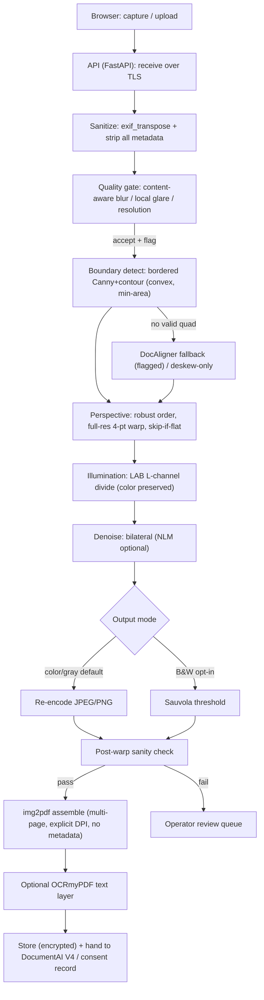

# Document Scanner Webapp — Product Requirements Document
### Consent Management Program · Adobe Scan–class image cleanup

| Field | Value |
|---|---|
| Version | 0.1 (draft, for review) |
| Date | 2026-06-08 |
| Owner | Claudio |
| Form factor (current phase) | **Web application** — browser client + self-hosted API |
| Related docs | *Server-Side Document Scanner Pipeline* (research report); architecture pressure-test; DocumentAI V4 quality-assessment stage |
| Processing core | Classical, GPU-free OpenCV pipeline (validated in research), with review corrections folded in |

> Requirements tagged **[PT]** originate from the architecture pressure-test and exist to close a specific failure mode. Requirements tagged **[assumption]** encode a decision not yet confirmed — see §19.

---

## 1. Summary

We are building an Adobe Scan–class document-cleanup capability inside the consent management program. A user submits a phone photo of a signed consent form through a web interface; the system detects the page, corrects perspective and lighting, reduces noise, and produces a clean, archival PDF — entirely on self-hosted infrastructure, with no PHI leaving our environment.

The current delivery target is a **web application** (browser capture/upload + server-side processing). Native mobile is explicitly deferred. The processing engine is the classical OpenCV pipeline from the research phase, with the corrections found during architecture review treated as hard requirements rather than nice-to-haves.

## 2. Background & Problem

Consent forms reach us as phone photos — skewed, shadowed, noisy, and sometimes filling the frame with no visible margin. Raw images hurt legibility, archival quality, and the downstream DocumentAI V4 quality-assessment stage. Consumer scanner apps (Adobe Scan, Microsoft Lens, CamScanner) solve this on-device, but we need it **server-side**: capture happens on the user's uncontrolled device, and correction must not depend on their hardware or add friction to their experience. Because this is a commercial healthcare product, the solution must be **commercially clean** (no research-only or AGPL components in the image path) and **privacy-preserving** (no third-party APIs, no PHI egress).

## 3. Goals / Non-Goals

**Goals**
- **G1** Replicate the core Adobe Scan result: auto-crop, perspective correction, illumination/shadow flattening, denoise, PDF export.
- **G2** Deliver as a self-hosted web application (browser capture/upload + server processing).
- **G3** Keep all processing server-side, GPU-free, and sub-second per page on commodity CPU at typical resolutions.
- **G4** 100% commercially clean licensing; no PHI leaves the environment.
- **G5** Preserve signatures, initials, blue ink, and stamps — the legal integrity of the consent record depends on it.
- **G6** Integrate with the existing DocumentAI V4 quality-assessment stage and the consent record.
- **G7** Provide manual override (re-crop, rotate, re-filter) for the cases auto-correction gets wrong.

**Non-Goals (current phase)**
- **NG1** Native iOS/Android apps.
- **NG2** Full geometric dewarping of curled/folded pages — hard-case-only, deferred; never ship research-licensed weights.
- **NG3** Third-party cloud sync or storage.
- **NG4** Structured form-field data extraction / form understanding.
- **NG5** Real-time collaborative editing.

## 4. Users & Personas

- **Submitter (data subject)** — uploads or captures the consent-form photo; non-technical; on a desktop or mobile browser; wants it to "just work" without retakes.
- **Operator / reviewer (internal staff)** — handles flagged or low-confidence scans, applies manual correction, approves.
- **Consuming system** — DocumentAI V4 and the consent record store and assess the cleaned PDF.
- **Administrator** — configures gate thresholds, output defaults, and retention policy.

## 5. Scope — Current Phase

**In:** browser camera capture (`getUserMedia`) and file upload; server-side pipeline; review/adjust UI; multi-page documents; color / grayscale / B&W output; lossless-or-quality PDF; optional OCR text layer; V4 integration; operator review queue.

**Out:** everything under Non-Goals.

## 6. User Flows

**6.1 Primary — submit & auto-clean**
1. User opens the scan page; grants camera access or selects files.
2. Captures or uploads one or more pages.
3. Client strips obvious metadata and uploads over TLS to **our** API only.
4. Server runs the pipeline and returns per-page previews + a confidence score.
5. User reviews; if a page is flagged or looks wrong, user adjusts corners, rotates, or changes the filter.
6. User reorders/deletes pages and confirms.
7. Server assembles the PDF, stores it against the consent record, and hands metadata to V4.
8. User sees confirmation — no retake in the common case.

**6.2 Secondary — operator review**
- Low-confidence or gate-flagged scans land in a review queue; an operator corrects and approves them.

## 7. Functional Requirements

**Capture & ingest**
- **FR-1** The client shall support live camera capture (`getUserMedia`) and file upload (JPEG/PNG/HEIC; HEIC transcoded), single- and multi-page.
- **FR-2** The client shall send image data only to our self-hosted API over TLS; no third-party endpoints, CDNs, fonts, or analytics shall receive image data. *(privacy)*
- **FR-3** The system shall run `exif_transpose`, then **strip all metadata** (EXIF/GPS/timestamp/device IDs) from every processed image and from any retained original used downstream. The invalid EXIF orientation value `0` (Android/Canon) shall be sanitized before PDF assembly. **[PT]** *(EXIF is a PHI/PII leak, not just an orientation fix.)*
- **FR-4** The API shall enforce upload hardening: allow-listed MIME/type, max file size, max pixel count (decompression-bomb guard, e.g. `Image.MAX_IMAGE_PIXELS`), and decode inside an isolated worker. **[PT]**
- **FR-5** The system shall detect non-photo inputs (already-clean scans, screenshots, uploaded PDFs) and skip or soften the camera pipeline so it does not degrade a clean source. **[PT]**

**Quality gate**
- **FR-6** The system shall score each page for blur, glare/overexposure, and resolution.
- **FR-7** The blur metric shall be **content-aware** so sparse, mostly-white consent forms are not falsely rejected — e.g. region-restricted sharpness or Tenengrad rather than a naive global variance-of-Laplacian. **[PT]**
- **FR-8** The glare metric shall use local/region analysis rather than a single global near-white fraction, so well-lit white pages pass while localized hotspots are still caught. **[PT]**
- **FR-9** Gate policy shall default to **accept-and-best-effort with a confidence flag** (never silently block), configurable to reject-and-request-retake per deployment. Rationale: the stated product goal is to not hamper UX. **[PT] [assumption]**
- **FR-10** Gate thresholds shall be configurable and calibrated to capture resolution; defaults documented, never hard-coded magic numbers. **[PT]**

**Boundary detection**
- **FR-11** Primary detector: grayscale → blur → Canny → contours → largest **convex** 4-point `approxPolyDP`, with a small border pad so an edge-touching document still closes into a contour. **[PT]**
- **FR-12** The detected quad shall pass a convexity check **and** a minimum-area floor (e.g. ≥ 30% of frame) to reject stamps, logos, and sub-regions being mistaken for the page. **[PT]**
- **FR-13** An optional **DocAligner (Apache-2.0)** corner detector shall be available behind a feature flag, triggered only when no valid quad is found (full-frame forms, low-contrast backgrounds). Its **training-data** license shall be verified before enablement. **[PT]**
- **FR-14** If neither method finds a boundary, the system shall fall back to deskew-only on the full frame.

**Perspective & geometry**
- **FR-15** Corner ordering shall be robust to rotation (angle/geometry-based, not naive sum/diff) to handle significantly rotated captures. **[PT]**
- **FR-16** Apply 4-point `getPerspectiveTransform` + `warpPerspective` at **full resolution**; detection may run on a downscaled copy for speed.
- **FR-17** If the page is already near-frontal (skew below threshold and boundary ≈ full frame), skip the warp to avoid resampling artifacts; apply deskew only.
- **FR-18** Full geometric dewarping is out of scope; if later required, only commercially-clean (retrained/owned) models may ship. *(NG2)*

**Illumination**
- **FR-19** Illumination flattening shall **preserve color** by operating on the L channel in LAB (or per-channel), **not** by converting to grayscale — so blue ink and colored stamps survive. Background is estimated via morphological close / large blur, divided out, and recombined. **[PT — critical; the headline design goal]**
- **FR-20** The morphological/blur kernel shall **scale with image resolution**, not a fixed pixel size. **[PT]**
- **FR-21** Optional contrast finishing (CLAHE / white-point) shall be available without crushing light ink.

**Denoise**
- **FR-22** Default denoise shall be an edge-preserving bilateral filter tuned to preserve thin strokes and signature lines.
- **FR-23** Non-Local Means shall be available as an optional higher-quality mode, with its latency cost documented (seconds on full-res multi-MP images). It shall **not** be the default, given the sub-second target. **[PT]**

**Output & PDF**
- **FR-24** Default output shall be **color** (or flattened grayscale), never binarized by default — to protect signature/stamp legibility.
- **FR-25** B&W "scan look" via **Sauvola** adaptive threshold shall be an explicit opt-in mode only.
- **FR-26** PDF assembly shall use **img2pdf**. The processed page is re-encoded before embedding, and the tradeoff is made explicit: **JPEG (small, lossy) is the default; PNG (lossless, larger) is selectable.** "Lossless AND small AND processed" is not simultaneously achievable and shall not be promised in copy or docs. **[PT]**
- **FR-27** PDF DPI shall be set explicitly (assume Letter/A4 physical size unless detected) so downstream tools see correct dimensions. The output PDF shall contain **no image metadata**.
- **FR-28** Multi-page: ordered pages assemble into one PDF; users may reorder, rotate, and delete pages before export. *(Adobe Scan parity)*
- **FR-29** Optional **OCRmyPDF (Tesseract)** text layer for a searchable archive, as a final opt-in stage.

**Confidence & manual override**
- **FR-30** After warp, a **post-warp sanity check** (plausible aspect ratio, output not mostly uniform/black) shall gate the result; failures are flagged for review rather than silently shipped. **[PT]**
- **FR-31** The review UI shall let users drag the four corners, re-run the warp, rotate in 90° steps, and switch output mode, with live preview. *(Adobe Scan parity)*
- **FR-32** Each page shall carry a confidence score surfaced to the user and operator.

## 8. Non-Functional Requirements

- **NFR-1 Latency** — p50 < 1s/page, p95 < 3s/page on a single commodity CPU core at typical capture resolution with bilateral denoise. NLM mode exempt; benchmark on representative consent-form photos before committing to SLAs.
- **NFR-2 Throughput** — scale **horizontally** with stateless workers before considering a GPU; the pipeline parallelizes per image.
- **NFR-3 Self-hosted** — no third-party API or CDN in the image path; functional fully air-gapped except for OS/package mirrors.
- **NFR-4 Security** — TLS in transit; encryption at rest for originals and outputs; isolated decode workers; input hardening per FR-4.
- **NFR-5 Privacy / compliance** — align with the applicable regulation for the deployment (HIPAA for US, India's DPDP Act, etc.); metadata stripped; audit log of transformations; configurable retention/deletion of originals.
- **NFR-6 Licensing** — every library/model touching an image must be permissive or weak-copyleft (MIT/BSD/Apache, or LGPL for libraries). **The deciding rule for our server-side/SaaS context: AGPL is the line** (network use counts as distribution), so AGPL is out; everything else is fine because we ship no binaries. Blockers: PyMuPDF (AGPL), DocTr/GeoTr/DocGeoNet ("contact for commercial use"), HED/BSDS500 weights (non-commercial training data). **[PT]**
- **NFR-7 Reliability** — a failed page must not fail the whole document; partial results recoverable.
- **NFR-8 Observability** — per-stage timing and gate metrics logged, with **no PHI in logs**.

## 9. System Architecture

No PHI ever leaves the environment; the browser talks only to our API.

**Components**
- **Web client (SPA)** — capture/upload, preview, corner-adjust canvas, page management, export trigger.
- **API (FastAPI)** — auth, session, upload handling, orchestration, status.
- **Processing workers** — stateless OpenCV pipeline; scale horizontally.
- **Storage** — encrypted store for originals, processed pages, and PDFs; SQLite (PoC) → Postgres for sessions/metadata.
- **Integration** — hands the cleaned PDF + quality metrics to DocumentAI V4 and writes to the consent record.

## 10. Image-Processing Pipeline Spec (corrected)

The buildable core, in order (maps to the FRs):

1. **Ingest & sanitize** — decode in worker, `exif_transpose`, strip all metadata, make a downscaled copy for detection (keep full-res). *(FR-3, FR-4)*
2. **Non-photo branch** — route clean scans/screenshots/PDFs around the camera pipeline. *(FR-5)*
3. **Quality gate** — content-aware blur, local glare, resolution; accept-and-flag default. *(FR-6–10)*
4. **Boundary detect** — bordered Canny + contour, convex + min-area quad; DocAligner fallback flag. *(FR-11–14)*
5. **Perspective** — robust corner order; full-res 4-point warp; skip-if-flat + deskew fallback. *(FR-15–17)*
6. **Illumination** — LAB L-channel divide-by-background, color preserved, resolution-scaled kernel. *(FR-19–21)*
7. **Denoise** — bilateral default; NLM optional. *(FR-22–23)*
8. **Output mode** — color/gray default; Sauvola B&W opt-in. *(FR-24–25)*
9. **Post-warp sanity** — aspect/coverage check → flag or pass. *(FR-30)*
10. **PDF** — re-encode (JPEG default / PNG option), explicit DPI, metadata-free, multi-page assemble; optional OCR layer. *(FR-26–29)*
11. **Persist & integrate** — store encrypted, hand to V4, write consent record.

## 11. API Surface (sketch)

- `POST /api/scans` — create session, upload page(s); returns `scan_id` + per-page job ids.
- `GET /api/scans/{id}` — status + per-page previews + confidence + gate flags.
- `POST /api/scans/{id}/pages/{pid}/recrop` — body: 4 corner points; re-runs warp + downstream.
- `POST /api/scans/{id}/pages/{pid}/rotate` — 90° steps.
- `POST /api/scans/{id}/pages/{pid}/mode` — `color | gray | bw`.
- `POST /api/scans/{id}/pages/reorder` — new order; `DELETE` for page removal.
- `POST /api/scans/{id}/export` — options: `ocr` (bool), `encoding` (jpeg|png), `dpi`; returns the PDF reference.
- All endpoints authenticated and rate-limited; no image data in any third-party call.

## 12. Data Model & Retention

- **ScanSession** — id, owner, consent_ref, status, created_at.
- **Page** — id, session_id, order, original_ref, processed_ref, mode, confidence, gate_flags, transforms[].
- **Pdf** — id, session_id, ref, encoding, dpi, ocr, created_at.
- **AuditEvent** — actor, action, target, timestamp (per transform).

Originals encrypted at rest; retention configurable (e.g. purge originals after N days or once consent is finalized) per NFR-5.

## 13. Edge Cases & Error Handling

- **Already-flat / full-frame form** → skip warp, try DocAligner, or accept whole frame.
- **Non-photo upload** → bypass the camera pipeline.
- **Rotated capture** → robust corner ordering.
- **Multi-MB photo** → detect on downscale, output full-res; NLM latency caveat applies.
- **Gate failure** → flag + best-effort (default) or request retake (configurable).
- **Bad warp** → post-warp sanity flag → operator review queue.
- **Partial multi-page failure** → per-page recovery; the document still assembles from good pages.
- **Corrupt / oversized file** → rejected at the hardening layer with a clear client error.

## 14. Tech Stack & Dependencies

| Component | Choice | License | Note |
|---|---|---|---|
| Frontend | React + Tailwind *(recommended)* | MIT | `getUserMedia`, canvas for corner UI; self-hosted assets |
| API | FastAPI | MIT | orchestration, status |
| CV core | OpenCV (`opencv-python-headless`) | Apache-2.0 (≥4.5) | headless server wheel |
| Arrays | NumPy | BSD-3 | |
| Binarization/restoration | scikit-image | BSD-3 | Sauvola threshold |
| Image/EXIF | Pillow | MIT/HPND | `exif_transpose`, transcode |
| PDF assembly | img2pdf | LGPL-3.0 | safe; weak copyleft |
| Corner fallback *(optional)* | DocAligner | Apache-2.0 | verify training-data license |
| OCR *(optional)* | Tesseract / OCRmyPDF | Apache-2.0 / MPL-2.0 | searchable layer |
| DB | SQLite → Postgres | — | PoC → production |
| **Avoid** | PyMuPDF | **AGPL-3.0** | network-use trigger |
| **Avoid** | DocTr / GeoTr / DocGeoNet | research-only | "contact for commercial use" |
| **Avoid** | HED `*_bsds.caffemodel` | non-commercial weights | retrain if HED needed |

## 15. Security, Privacy & Compliance

TLS in transit and encryption at rest (FR-2, NFR-4); isolated decode workers and input hardening (FR-4); **metadata stripped on every image as a PHI control** (FR-3); audit trail of transformations and configurable retention/deletion of originals (§12, NFR-5); no PHI in logs (NFR-8). Compliance target depends on deployment jurisdiction (HIPAA / DPDP / other). License posture per NFR-6; **license statements to be verified by counsel before ship.**

## 16. Milestones / Phasing

- **M1 (MVP)** — file upload (no live camera yet), classical pipeline, color PDF, basic preview with manual recrop/rotate, V4 handoff, single + multi-page.
- **M2** — in-browser camera capture, B&W Sauvola mode, page reorder/delete, confidence scoring + operator review queue.
- **M3** — DocAligner fallback (flagged), OCRmyPDF text layer, throughput scale-out.
- **M4 (conditional)** — dewarping for genuinely curled forms, commercially-clean models only — *only* if a meaningful fraction of uploads are physically non-flat.

**Decision thresholds (from the research report):**
- > ~10–15% of uploads fail the classical boundary detector → invest in DocAligner.
- A meaningful fraction of forms are physically curled/folded (not just skewed) → evaluate dewarping (with the licensing caveat).
- CPU throughput exceeded → scale horizontally before reaching for a GPU.
- Searchable archive required → add the OCR layer.

## 17. Success Metrics

- **% of uploads requiring zero manual correction** (target high).
- **Gate false-reject rate** on good uploads (target low).
- **p50 / p95 latency** per page.
- **Signature & stamp legibility** pass rate (sampled review).
- **Boundary-detection success rate** (drives the DocAligner decision).
- **Operator review rate** and time per scan.

## 18. Risks & Mitigations

| Risk | Mitigation |
|---|---|
| False rejects on sparse white forms | content-aware blur gate (FR-7) + accept-and-flag default (FR-9) |
| Color loss destroying signature legibility | LAB-preserving illumination flatten mandated (FR-19) |
| Metadata / PHI leak via retained originals or PDF | strip all metadata (FR-3), encrypt, retention policy (§12) |
| License contamination in the image path | code-review rule (NFR-6); verify DocAligner weights (FR-13) |
| Latency blowups from NLM / full-res | bilateral default (FR-22), downscale detection (FR-16), benchmark before SLA |
| Bad warps shipped unattended | post-warp sanity check (FR-30) + review queue |
| Scope creep into dewarping / native mobile | explicit non-goals (§3) + phased thresholds (§16) |

## 19. Open Questions & Assumptions

**Assumptions baked in (confirm or correct):**
- **A1** Gate policy = accept-and-best-effort with a confidence flag, chosen to protect UX. *(FR-9)*
- **A2** Native mobile is out of scope this phase ("currently a webapp"). The truncated *"mobile document…"* note may override this.
- **A3** DocumentAI V4 exposes reusable sharpness/contrast/brightness/skew metrics the gate can consume; exact interface TBD.
- **A4** Deployment jurisdiction determines the governing regulation (HIPAA vs DPDP); both accommodated.

**Open questions:**
- **Q1** What is V4's actual quality-assessment interface (metrics + output format)?
- **Q2** Is a mobile/native component coming (the cut-off capsule)?
- **Q3** Must originals be retained for legal/audit, and for how long?
- **Q4** Expected volume/throughput (drives single-node vs scale-out)?
- **Q5** Are multi-page packets common, and is page reordering needed at MVP?
